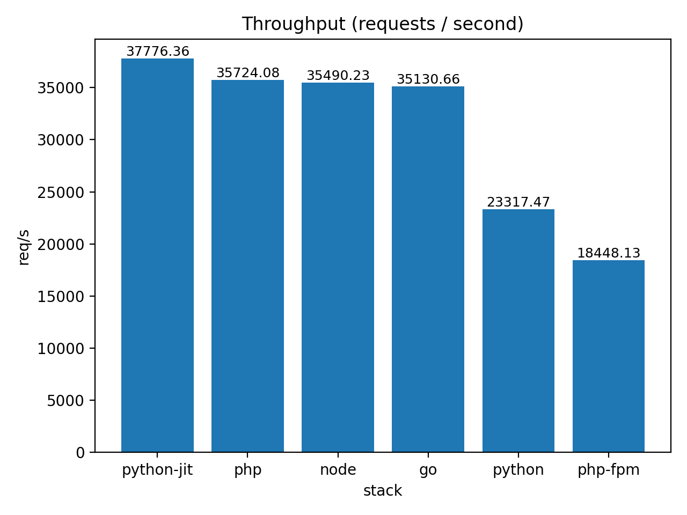
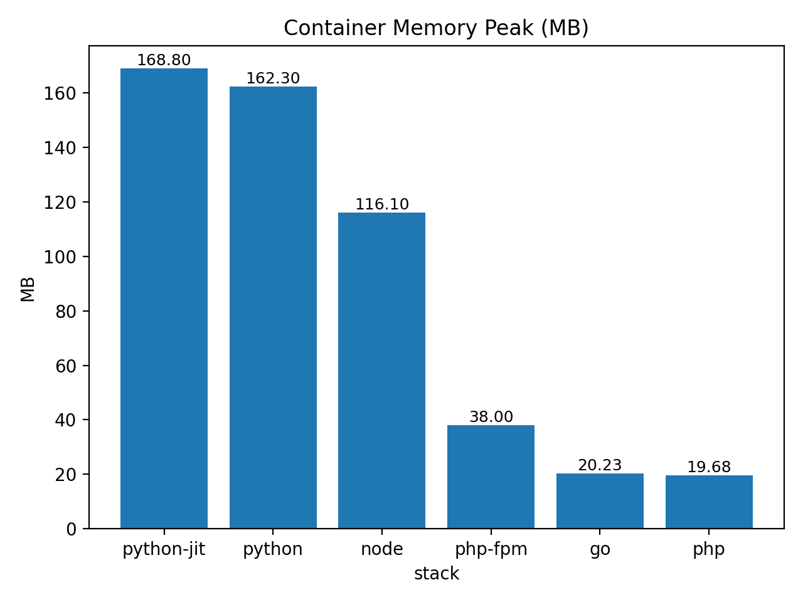
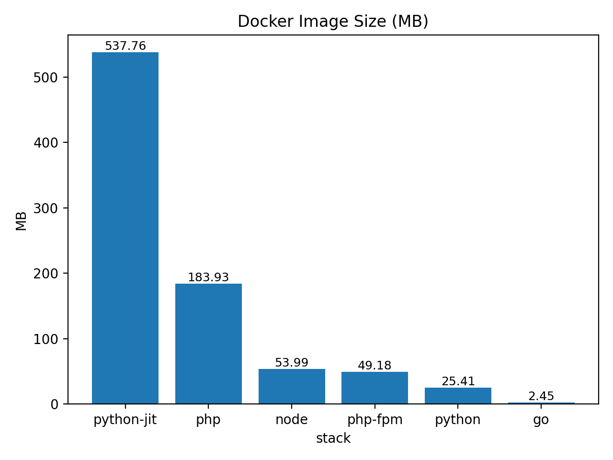

# Small Benchmark Between PHP, Python, NodeJs, Go

Results:









## Install
```bash
python3 -m venv .venv && source .venv/bin/activate
pip install -r scripts/requirements.txt
```

## Run
```bash
bash scripts/run.sh
python3 analysis/parse_and_plot.py
```

## Stacks
- Python (FastAPI + Uvicorn)
- Python JIT (FastAPI + Uvicorn)
- PHP (OpenSwoole)
- PHP (FPM + Nginx)
- Go (net/http)
- Node.js (HTTP cluster)

## Results
Go in ./results/ dir
